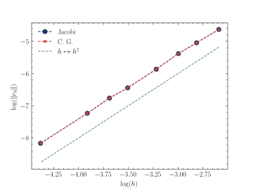

# Projet 2 : Problème stationnaire avec grille non-structurée

Ce projet porte sur la résolution numérique parallèle d’un problème stationnaire sur un domaine discret. Il se concentre sur la mise en œuvre de méthodes itératives parallélisées de type Jacobi et Gradient Conjugué pour résoudre des systèmes linéaires dérivés d’une discrétisation par éléments finis.


## Installation
1.	Pré-requis :
    - MPI : Assurez-vous d’avoir MPI installé (ex. OpenMPI ou MPICH).
	- Compilateur C++ compatible avec les normes modernes de C++.
2.	Compilation :
    ```bash
    # depuis la racine du projet
    make
    ```


3. Création du maillage et partionnement:
    Avant d’exécuter les scripts, il est nécessaire de générer un maillage partitionné en sous-domaines :

    ```bash
    # depuis la racine du projet
    gmsh -2 -part 4 benchmark/mesh.geo
    ```
    - créer le maillage associé à la géométrie définie par le fichier `benchmark/mesh.geo`
    - partionne le domaine en 4 sous-domaine

4. Exécution :
    Lancer le programme en spécifiant le nombre de processus (par exemple, 4) : 
    ```bash
    # depuis la racine du projet
    mpirun -np 4 solver benchmark/mesh.msh
    ```

5. Affichage avec gmsh:
    ```bash
    # depuis la racine du projet
    gmsh benchmark/mesh.msh results/*.msh_*
    ```

## Description du Projet

### Problème considéré
On considère le problème stationnaire suivant sur un domaine rectangulaire $\Omega = ]0,a[\times]0,b[$. 

Pour $f\in L^2(\Omega)$ et $\alpha \in \mathbb{R}$ :

$$
\left|\begin{aligned}
\text{ Trouver } u \in H^1(\Omega) \text{ telle que :} \\
\quad \alpha u - \Delta u &= f,\ & \text{dans } \Omega\\
\quad  \partial_{\boldsymbol{n}} u &= 0,\ & \text{sur } \partial\Omega
\end{aligned}
\right.
$$

Qui est équivalent à la formulation variationnelle :
$$
\left|\begin{aligned}
&\text{ Trouver } u \in H^1(\Omega) \text{ telle que :} \\
&\quad \forall v \in H^1(\Omega),\ \alpha\int_\Omega uv\ \text{d} \Omega + \int_\Omega \nabla u \cdot \nabla v\ \text{d}\Omega = \int_\Omega fv\ \text{d} \Omega
\end{aligned}
\right.
$$

### Problème discrétisé
On utilise un schéma d'éléments finis $\mathbb{P}_1$ basé sur un maillage de triangle $\mathcal{T}_h$ de $\Omega$ et on obtient le système discrétisé :

$$
\boldsymbol{A} \boldsymbol{u} = \boldsymbol{b}
$$
où : 
- $\boldsymbol{A} = \alpha\boldsymbol{M} + \boldsymbol{K}$ avec $\boldsymbol{M}_{ij} = \int_\Omega w_iw_j\ \text{d} \Omega$, $\boldsymbol{K}_{ij} = \int_\Omega \nabla w_i \cdot \nabla w_j\ \text{d} \Omega$
- $\boldsymbol{b} = \boldsymbol{M}\boldsymbol{f}$ avec $\boldsymbol{f}_i = f(M_i)$
- $\boldsymbol{u}_i = u_h(M_i)$.

### Méthodes de résolution
On résoud dans ce projet le système $\boldsymbol{A} \boldsymbol{u} = \boldsymbol{b}$ par méthode de Jacobi et du gradient conjugué dont les implémentations seront parallélisées.

L'énoncé ainsi que les scripts de départ se trouvent aux adresses suivantes : 
- https://ms01.pages.math.cnrs.fr/projet2.pdf
- https://plmlab.math.cnrs.fr/ms01/codes-project-fem-2024/

Les scripts donnés proposent une stratégie de paralélisation par groupes d'éléments i.e. : les sous-domaines de $\Omega$ associés à chaque processus sont séparés par les frontières réelles des éléments du maillage (voir https://ms01.pages.math.cnrs.fr/slides6.pdf pour plus détails, en particulier la slide 12 pour voir les différentes stratégies de parallélisation ainsi que la notation utilisée dans ce projet).

## Calcul des normes 2 et $L^2(\Omega)$

Dans la stratégie de parallélisation adoptée, le calcul parallèle de la norme $L^2(\Omega)$ donnée par $\|\boldsymbol{u}\|_{L^2(\Omega)}^2 = \boldsymbol{u}^T\boldsymbol{M}\boldsymbol{u}$ est direct : chaque processus calcule cette norme sur son sous-domaine, et un `MPI_Allreduce` permet de sommer les résultats.

Pour la norme 2 donnée par $\|\boldsymbol{u}\|_2^2 = \sum_{i}u_i^2$, la situation est plus complexe car certains nœuds sont partagés entre sous-domaines, ce qui introduit des duplications dans le comptage des nœuds partagés lors de l’addition avec `MPI_Allreduce`. Ce problème est résolu grâce à un vecteur `nodeMultiplicity`, indiquant le nombre de fois qu’un nœud est partagé entre processus voisins.

Assemblage de `nodeMultiplicity` (se trouve dans `parallel.cpp`):
```cpp
std::unordered_map<int, int> nodeMultiplicityMap;
for (int nTask = 0; nTask < nbTasks; nTask++) {
    if (nTask != myRank) {
        for (int nExch = 0; nExch < mesh.numNodesToExch(nTask); nExch++) {
            int nodeIndex = mesh.nodesToExch(nTask, nExch);
        nodeMultiplicityMap[nodeIndex]++;
        }
    }
}

  mesh.nodeMultiplicity.resize(mesh.nbOfNodes);
  mesh.nodeMultiplicity.setZero();

for (std::unordered_map<int, int>::const_iterator it = nodeMultiplicityMap.begin(); it != nodeMultiplicityMap.end(); ++it) {
    int nodeIndex = it->first;
    int multiplicity = it->second;
    mesh.nodeMultiplicity(nodeIndex) = multiplicity;
}
```

## Implémentation
On renvoie à https://ms01.pages.math.cnrs.fr/slides5.pdf pour le formalisme et les explications de l'algorithme du gradient conjugué et à https://ms01.pages.math.cnrs.fr/slides3.pdf pour celui de Jacobi. 

Nos implémentations de ces algorithmes se trouvent dans `solver.cpp`.

## Validation
<picture>

</picture>